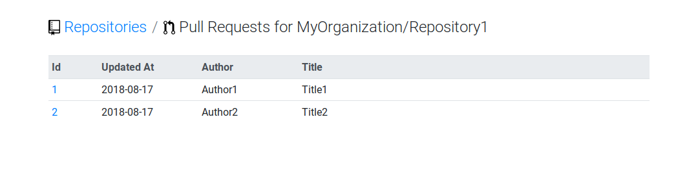

# github-dashboard

github-dashboard is a [Gitflow](https://nvie.com/posts/a-successful-git-branching-model) helper.

Its main function is to help identify GitHub projects with differences between the develop and master branches.

## Screenshots

### Repositories view

This view lists your GitHub repositories, along with:

* The current number of commits in develop that are not yet integrated into master;
* The current number of opened pull requests.


### Commits ahead view


### Pull requests view



## Installation

### 0. Requirements

* [Docker (tested with version 18.06.0-ce)](https://docs.docker.com/install/)
* [Docker Compose (tested with version 1.22.0)](https://docs.docker.com/compose/install/)

### 1. .env

Copy the `.env.dist` file and define the GitHub username and password that will be used to interact with GitHub's API.

```bash
cp .env.dist .env
sed -i 's/GITHUB_USERNAME=username/GITHUB_USERNAME=${YOUR_GITHUB_USERNAME}/g' .env
sed -i 's/GITHUB_SECRET=password_or_token/GITHUB_SECRET=${YOUR_GITHUB_SECRET}/g' .env
```

### 2. Build, install and run

```bash
make build
make install
make run
```

## Usage

### 1. Fetch

```bash
docker-compose exec php-apache php bin/console app:repository:fetch ${YOUR_GITHUB_ORGANIZATION}
docker-compose exec php-apache php bin/console app:repository:commit:compare:fetch
docker-compose exec php-apache php bin/console app:pull-request:fetch
```

### 2. Browse

```bash
x-www-browser "http://$(docker container inspect --format '{{ range .NetworkSettings.Networks }}{{ .IPAddress }}{{ end }}' $(docker container list --format '{{ .Names }}' --filter 'name=php-apache'))"
```

## Development

### Reset the database

```bash
make reset
make install-php-doctrine
```

### Run the tests

```
make test
```

## Resources

* [GitHub Octicons](https://octicons.github.com)
